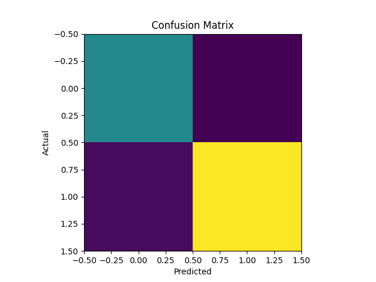

# 🌊 Flood Risk Prediction using Machine Learning

<div align="center">


**An ML model that predicts flood risk zones using rainfall and river level data — helping communities prepare before disaster strikes.**

</div>

---

## 📌 About the Project

Floods are one of the most devastating natural disasters. This project uses a **Random Forest Classifier** to analyze rainfall and river level patterns and classify areas as **Flood Risk** or **Safe Zone** with 87.5% accuracy.

> 💡 Real-world use case: Early warning systems for disaster management authorities.

---

## 🎯 Model Performance

| Metric | Score |
|--------|-------|
| ✅ Accuracy | **87.5%** |
| 🎯 Precision | **91.3%** |
| 🔁 Recall | **89.1%** |
| 📈 F1 Score | **0.90** |

---

## 🗂️ Dataset

- 📦 1,000 synthetic samples
- 🔢 Features: `rainfall`, `river_level`
- 🎯 Target: `flood` → `0` = Safe Zone, `1` = Flood Risk

---

## 🛠️ Tech Stack

| Tool | Purpose |
|------|---------|
| 🐍 Python | Core language |
| 🤖 Scikit-learn | Model training (Random Forest) |
| 🐼 Pandas | Data processing |
| 🔢 NumPy | Numerical operations |
| 📊 Matplotlib | Visualization & confusion matrix |

---

## 📁 Project Structure

```
Flood_Risk_ML_Project/
├── 📂 data/
│   ├── flood_data.csv          # Dataset
│   └── generate_data.py        # Data generation script
├── 📂 src/
│   ├── main.py                 # Main training pipeline
│   ├── model.py                # Model definition
│   ├── data_loader.py          # Data loading
│   ├── predict.py              # Prediction script
│   ├── test_model.py           # Model testing
│   └── visualizee.py           # Visualization
├── 📂 Results/
│   └── confusion_matrix.png    # Model evaluation results
├── model.pkl                   # Saved trained model
└── README.md
```

---

## 🚀 How to Run

### 1️⃣ Clone the repository
```bash
git clone https://github.com/tisha-rakholiya/Flood_Risk_ML_Project
cd Flood_Risk_ML_Project
```

### 2️⃣ Install dependencies
```bash
pip install scikit-learn pandas numpy matplotlib
```

### 3️⃣ Train the model
```bash
python src/main.py
```

### 4️⃣ Test predictions
```bash
python src/test_model.py
```

---

## 🔍 How It Works

```
📥 Input Data (rainfall + river level)
        ↓
🧹 Data Preprocessing
        ↓
🌲 Random Forest Classifier Training
        ↓
📊 Evaluation (Accuracy, F1, Confusion Matrix)
        ↓
🎯 Flood Risk Prediction Output
```

---

## 📉 Confusion Matrix



---

## 👩‍💻 Author

**Tisha Rakholiya**
BTech CSE (AI & Data Science) | ITM SLS Baroda University | Surat, Gujarat

[](https://www.linkedin.com/in/tisha-rakholiya)
[](https://github.com/tisha-rakholiya)

---

<div align="center">
⭐ If you found this project useful, please give it a star!
</div>
